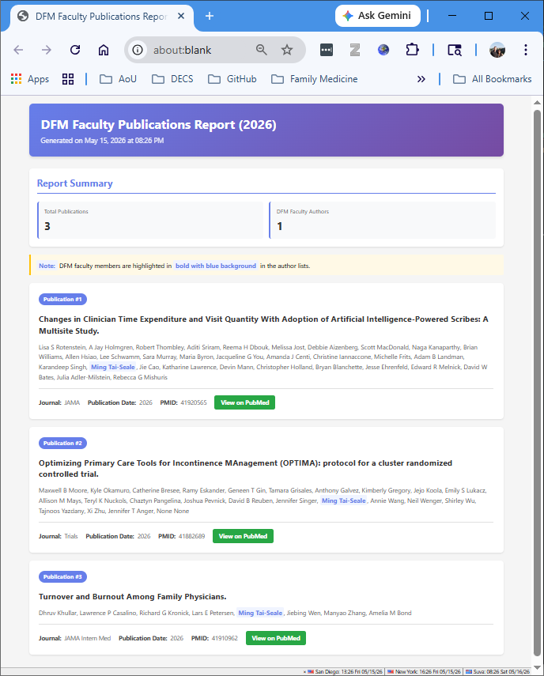
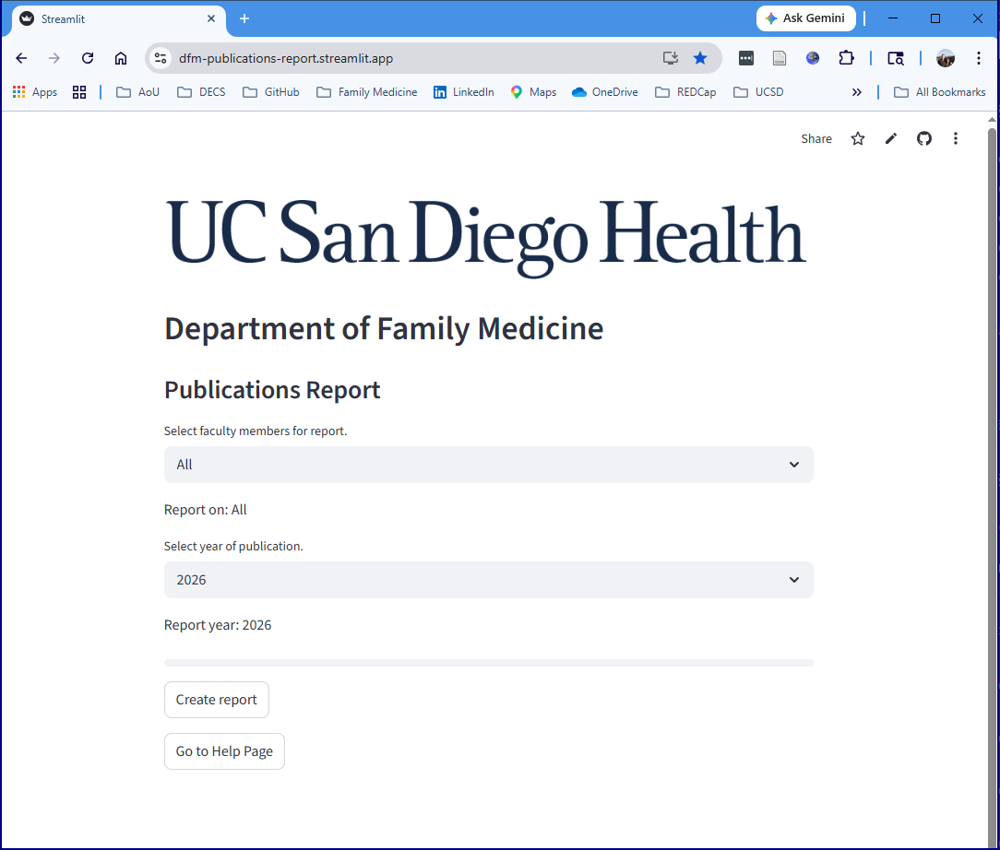
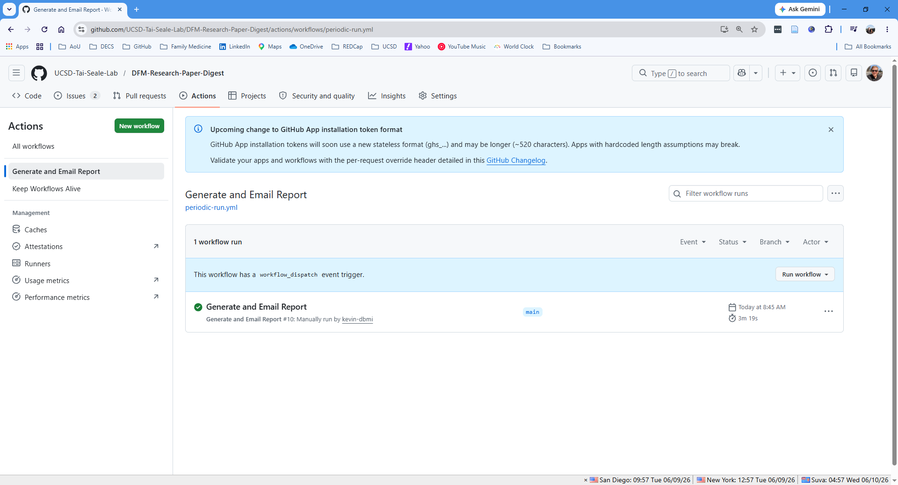
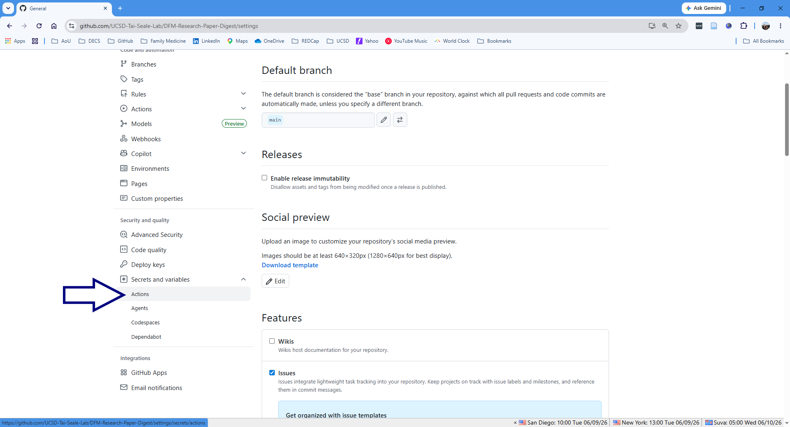
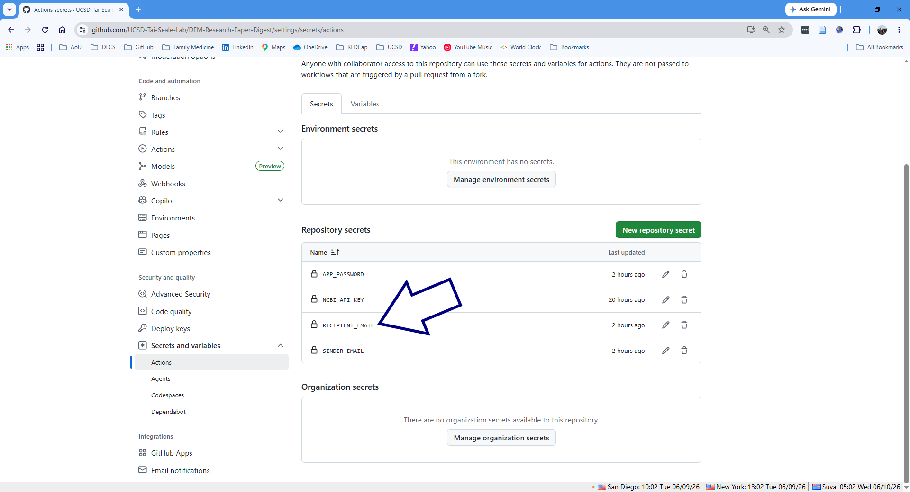
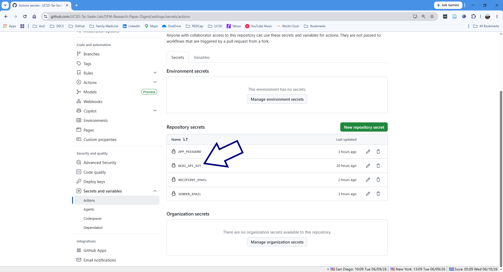
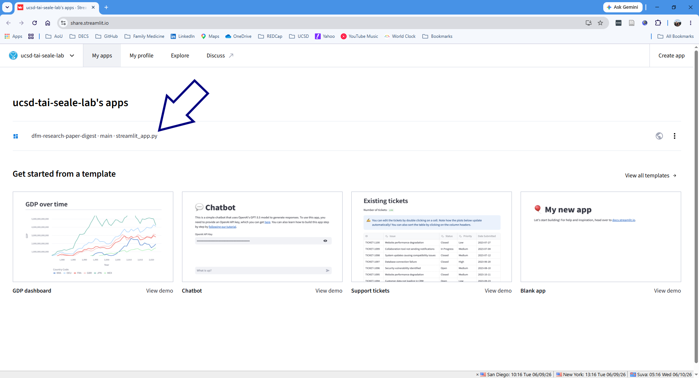
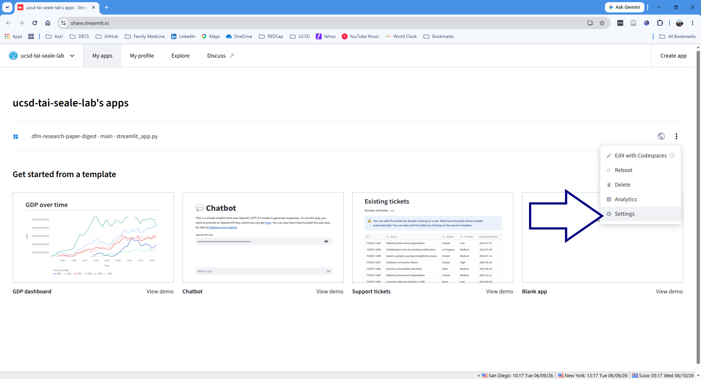
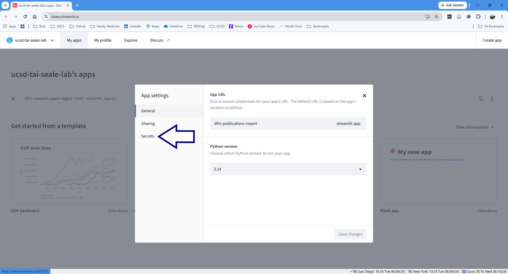
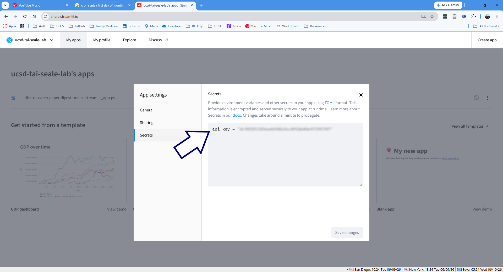

# PubMed Author Publications Query Tool
[

](https://github.com/psf/black)


A Python tool to query [PubMed](https://pubmed.ncbi.nlm.nih.gov/) for publications by specific authors--or all Department of Family Medicine faculty.

 

## Features
  - Easy web interface
  - ✨ DFM faculty members **highlighted in bold with blue background**
  - 📊 Summary statistics and visualizations
  - 🔗 Clickable links to PubMed
  - 📱 Responsive design for any device
  - 🖨️ Print-friendly formatting

## Usage

### 1. Web version

Go to https://dfm-publications-report.streamlit.app/ and select the faculty names and years, then click "Create report"

 

### 2. GitHub Actions version
This version runs automatically to generate and email the report to designated recipients. 

 

The action's periodicity is defined in file `.github/workflows/periodic-run.yml` and the recipients list is defined in Actions Secrets. To change, open Action Secrets here:



and revise the list here. (For multiple recipients, use a comma-separated list.)




## Development

### Install Python dependencies:
```bash
pip install -r requirements.txt
```
### To change ownership of the application:

1. Apply for an NCBI API key [here](https://www.ncbi.nlm.nih.gov/datasets/docs/v2/api/api-keys/) and save it in Actions Secrets:
	


2. Also save the NCBI API key in Streamlit secrets:






3. Change ownership of the gmail account used to email the reports, `commander.data.dfm@gmail.com`, by switching the recovery phone, email and 2FA authenticator to those of the new administrator.
4. Ensure new administrator has ownership role in [GitHub repository](https://github.com/UCSD-Tai-Seale-Lab/DFM-Research-Paper-Digest).
	
## API Information

This tool uses the Python [metapub](https://metapub.org/) library to handle PubMed interface.


## License

See the [LICENSE](LICENSE) file for details.

